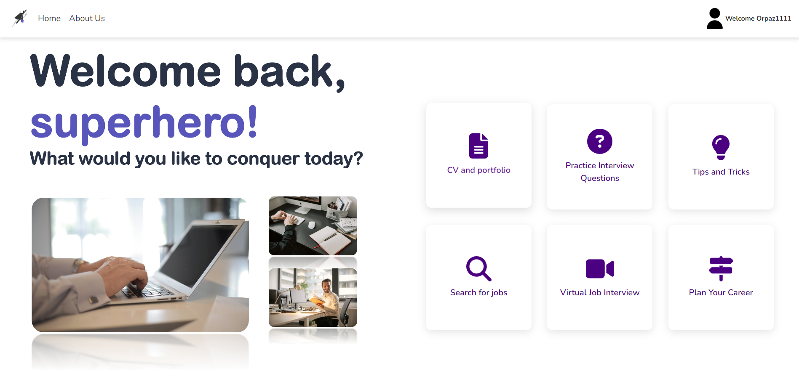
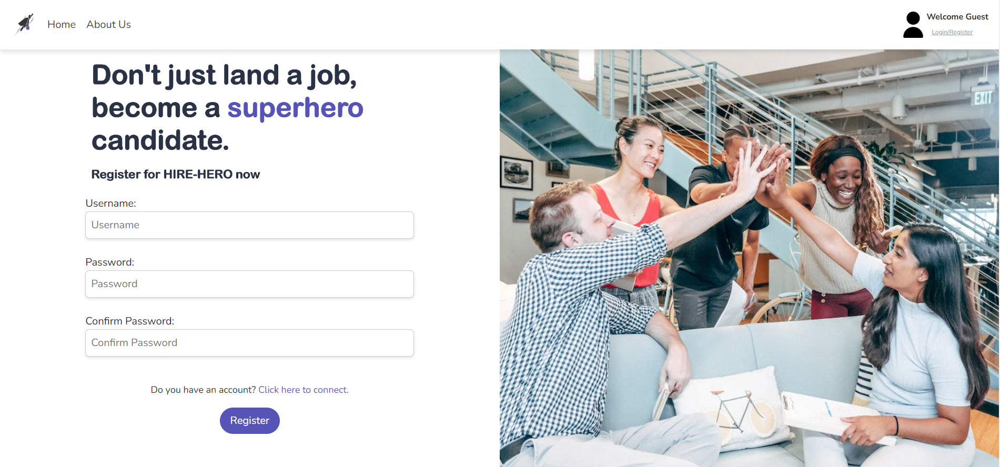
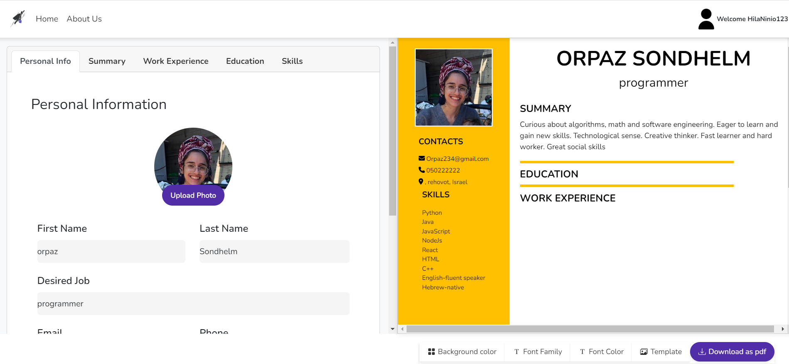
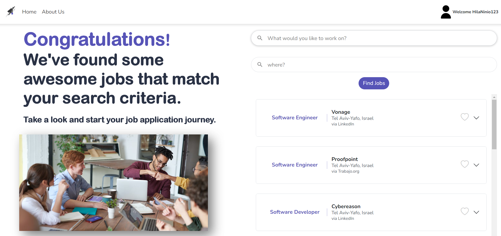
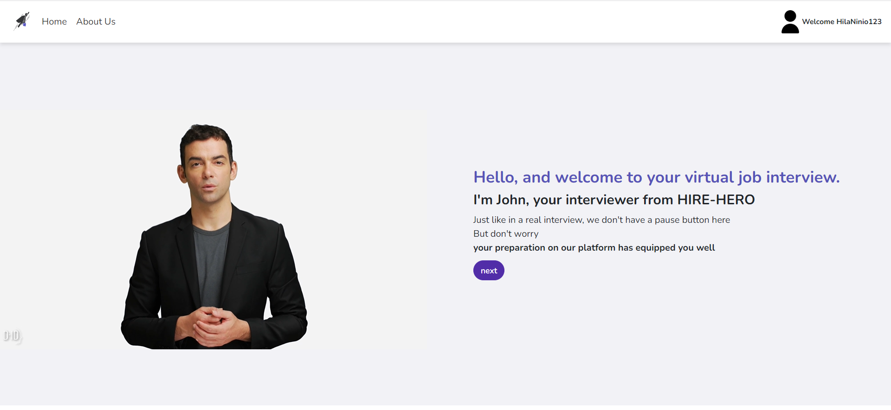
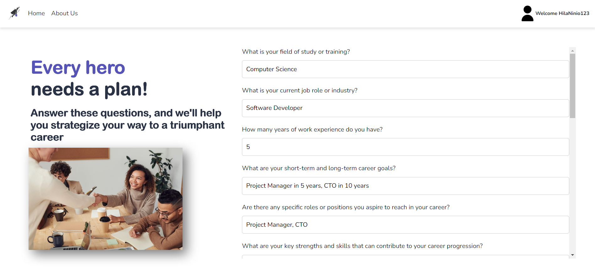

# Get-Hired

## about this project
Web application for preparing for job interviews 
The application includes - login and registration pages, an online code runner, a virtual job interview, 
preparing a resume, a job search interface , career planner and more.
 

### Registration page

### CV and protfolio

### Practice Interview Questions - Technical Questions

## Serch for jobs

## Virtual job interview

## career planner

## Built With

* react
* Node.js
* Express
* mongoDB
* googleAPIs
* OpenAI API